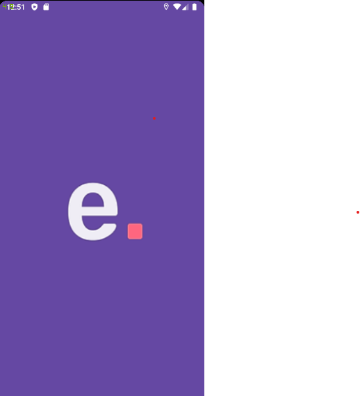

# E-Learning - Back-end 📚
<p align="center"></p>
<p align="center">Search for a large variety of courses, watch the classes, and mark your favorite one.</p>

<hr>




## Technologies 💻:
- Express
- Postgres
- TypeORM
- UUID
- Tsyringe

## How to run 🚀:
```bash
# Clone this repository
$ git clone https://github.com/EduardoBravoP/elearning-backend.git

# Go into the repository
$ cd elearning-backend

# Install dependencies
$ yarn

# Run the application in development mode
$ yarn dev:server

# The server will start on port:3333
```
